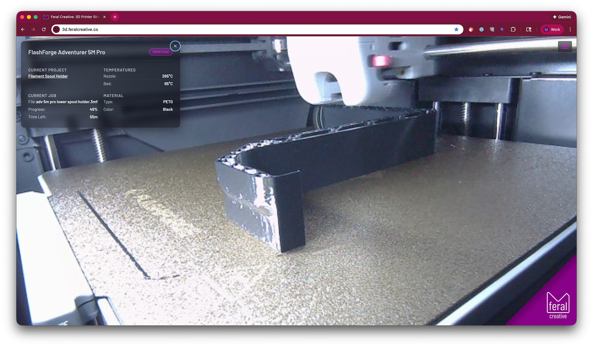

# 3D Printer Stream

Live stream of Feral Creative's FlashForge Adventurer 5M Pro 3D printer with real-time status overlay and Google OAuth authentication.



## Features

- **Live MJPEG Stream** - Real-time video from Synology Surveillance Station
- **Google OAuth Authentication** - Secure access with email whitelisting
- **Real-time Printer Status** - Temperature, progress, and print information overlay
- **3D Model Viewer** - View current print model in 3D by clicking the filename
- **Responsive Design** - Works on desktop and mobile devices
- **Dev Mode** - Bypass authentication on localhost for development
- **Docker Deployment** - Containerized deployment to Synology NAS

## 3D Model Viewer

The application includes an interactive 3D model viewer that allows you to view the current print model in 3D.

### How to Use

1. **Place Model Files**: Add your STL files to the `public/models/` directory
2. **Match Filenames**: The STL filename (without extension) must match the job filename reported by the printer
   - Example: If printer shows `test-cube.3mf`, place file as `public/models/test-cube.stl`
3. **Click to View**: When a print is active, click the filename in the printer status overlay to open the 3D viewer

### File Format

The viewer displays **STL files only**. The application automatically converts the printer's filename (e.g., `.3mf` from Orca Slicer) to `.stl` format:

- Printer reports: `my-model.3mf`
- Viewer looks for: `public/models/my-model.stl`

**Note**: You must export/save your original STL file with the same base filename as your sliced file.

### Viewer Controls

- **Rotate**: Click and drag with left mouse button
- **Zoom**: Scroll wheel or pinch gesture
- **Pan**: Right-click and drag (or two-finger drag on trackpad)
- **Close**: Click the X button, press ESC, or click outside the modal

### Example Workflow

```bash
# 1. You have an STL file
my-awesome-print.stl

# 2. Slice it in Orca Slicer, which creates
my-awesome-print.3mf

# 3. Send to printer (printer shows "my-awesome-print.3mf")

# 4. Place your original STL in the models directory
cp my-awesome-print.stl public/models/

# 5. Click the filename in the web interface to view the 3D model
```

**Note**: The viewer automatically strips the extension and looks for a `.stl` file. If the file is not found, an error message will be displayed.

## Quick Start

### Development

```bash
# Install dependencies
npm install

# Start both proxy server and dev server
npm start
```

This starts the **Vite dev server** on <http://localhost:5501>

Visit: <http://localhost:5501>

**Note:** In production, the printer API is accessed through a reverse proxy at `https://printer.yourdomain.com` which routes to the Docker container running `printer-proxy-server.js` on port 6199.

### Production Build

```bash
# Build for production
npm run build

# Preview production build
npm run preview
```

## Docker Deployment

### Prerequisites

- Docker installed locally (for building images)
- SSH access to your Synology NAS
- SSH key authentication configured
- Cloudflare API credentials (optional, for cache purging)

### Configuration

Update the deployment scripts (`utils/deploy/prod.sh` and `utils/deploy/deploy-utils.sh`) with your NAS details:

- **NAS Host**: Your NAS hostname or IP
- **SSH Port**: Your SSH port (default: 22)
- **NAS User**: Your NAS username
- **Deploy Path**: Path on NAS (e.g., `/volume1/web/your-project`)
- **Container Name**: Docker container name
- **Host Port**: Port to expose on host (e.g., 6198)

### Environment Variables

1. **Copy the example environment file:**

   ```bash
   cp .env.example .env
   ```

2. **Edit `.env` and configure:**

   ```bash
   # Application Configuration
   PORT=3000
   NODE_ENV=production
   SESSION_SECRET=your_random_secret_here

   # Cloudflare Configuration (Optional)
   CLOUDFLARE_API_TOKEN=your_cloudflare_api_token
   CLOUDFLARE_ZONE_ID=your_cloudflare_zone_id
   ```

3. **Get Cloudflare credentials (optional):**
   - API Token: <https://dash.cloudflare.com/profile/api-tokens>
     - Create token with "Zone.Cache Purge" permissions
   - Zone ID: <https://dash.cloudflare.com/> > Select domain > Overview (right sidebar)

### Deployment Steps

1. **Deploy to production:**

   ```bash
   ./utils/deploy/prod.sh
   ```

   This script will:

   - Build Docker image locally (linux/amd64 platform)
   - Save and compress the image
   - Transfer image to NAS via SSH
   - Load image on NAS
   - Create required directories
   - Deploy using docker-compose
   - Verify deployment
   - Purge Cloudflare cache (if configured)
   - Show container status and logs

2. **Monitor deployment:**
   The script provides real-time feedback with colored output:
   - 🔵 INFO - General information
   - 🟢 SUCCESS - Successful operations
   - 🟡 WARNING - Non-critical warnings
   - 🔴 ERROR - Critical errors

### Deployment Utilities

Manage the deployed container using the utilities script:

```bash
# View live logs (Ctrl+C to exit)
./utils/deploy/deploy-utils.sh logs

# Check container status
./utils/deploy/deploy-utils.sh status

# Restart container
./utils/deploy/deploy-utils.sh restart

# Stop container
./utils/deploy/deploy-utils.sh stop

# Start container
./utils/deploy/deploy-utils.sh start

# Open shell in container
./utils/deploy/deploy-utils.sh shell

# Backup data directory
./utils/deploy/deploy-utils.sh backup

# Restore from backup
./utils/deploy/deploy-utils.sh restore backup-file.tar.gz

# Sync local data to NAS
./utils/deploy/deploy-utils.sh update-data

# Show help
./utils/deploy/deploy-utils.sh help
```

### Cloudflare Cache Purging

The deployment script automatically purges Cloudflare cache after deployment if credentials are configured in `.env`.

**Setup:**

1. Add `CLOUDFLARE_API_TOKEN` and `CLOUDFLARE_ZONE_ID` to `.env`
2. Cache will be purged automatically after each deployment
3. If credentials are missing, cache purging is skipped (non-fatal)

**Manual cache purge:**

```bash
# Test cache purge
curl -X POST "https://api.cloudflare.com/client/v4/zones/${CLOUDFLARE_ZONE_ID}/purge_cache" \
  -H "Authorization: Bearer ${CLOUDFLARE_API_TOKEN}" \
  -H "Content-Type: application/json" \
  -d '{"purge_everything":true}'
```

### Accessing the Application

After deployment, the application is accessible at:

- **Direct**: <http://your-nas-hostname:6198>
- **Production**: <https://yourdomain.com> (via reverse proxy)

### Troubleshooting

**SSH Connection Issues:**

```bash
# Test SSH connection
ssh -p YOUR_SSH_PORT user@your-nas-hostname "echo 'Connection successful'"

# If prompted for password, add your SSH key
ssh-copy-id -p YOUR_SSH_PORT user@your-nas-hostname
```

**Docker Build Issues:**

```bash
# Ensure Docker is running
docker ps

# Test build locally
docker build --platform linux/amd64 -t 3d-printer-stream:latest .

# Check image size
docker images 3d-printer-stream:latest
```

**Container Not Starting:**

```bash
# Check container logs
./utils/deploy/deploy-utils.sh logs

# Check container status
./utils/deploy/deploy-utils.sh status

# Restart container
./utils/deploy/deploy-utils.sh restart
```

**Port Already in Use:**

- Port 6198 is configured for this project
- If port is in use, update `docker-compose.yml` and `utils/deploy/prod.sh`
- Choose a unique port not used by other projects

## Project Structure

```text
3d-printer-stream/
├── index.html                  # Main application page
├── auth.js                     # Google OAuth authentication
├── printer.js                  # Printer API client
├── printer-proxy-server.js     # Printer API proxy server (runs in Docker)
├── config.js                   # Application configuration
├── logger.js                   # Client-side logging utility
├── styles/
│   ├── scss/                  # SCSS source files
│   └── css/                   # Compiled CSS
├── images/                    # Images and icons
├── utils/
│   └── deploy/
│       ├── prod.sh            # Production deployment script
│       └── deploy-utils.sh    # Deployment utilities
├── Dockerfile                 # Docker image definition
├── docker-compose.yml         # Docker Compose configuration
├── .dockerignore              # Docker build exclusions
├── .env                       # Environment variables (not in git)
├── .env.example               # Environment template
└── vite.config.js             # Vite configuration
```

## Technology Stack

- **Frontend**: Vanilla JavaScript (ES6+), HTML5, CSS3
- **Build Tool**: Vite
- **Authentication**: Google Sign-In API (OAuth 2.0)
- **Video Stream**: MJPEG from Synology Surveillance Station
- **Printer API**: FlashForge Adventurer 5M Pro HTTP API
- **3D Model Viewer**: [Online 3D Viewer](https://github.com/kovacsv/online3dviewer) by Viktor Kovacs
- **Printer Proxy**: Node.js + Express (runs in Docker on port 6199)
- **Deployment**: Docker + Docker Compose on Synology NAS
- **Reverse Proxy**: Synology (printer.yourdomain.com → localhost:6199)
- **CDN**: Cloudflare (with automatic cache purging)

## Printer Proxy Architecture

The application uses a Node.js proxy server to communicate with the FlashForge printer:

### Production Setup

```text
Browser (yourdomain.com)
    ↓ HTTPS
Synology Reverse Proxy (printer.yourdomain.com)
    ↓ HTTP
Docker Container (printer-proxy-server.js:6199)
    ↓ HTTP
FlashForge Printer (192.168.1.XXX:8898)
```

### Configuration

1. **Reverse Proxy Rule** (Synology DSM):

   - Source: `https://printer.yourdomain.com:443`
   - Destination: `http://localhost:6199`

2. **Docker Container**:

   - Image: `3d-printer-stream:latest`
   - Port: 6199 (exposed to host)
   - Runs: `printer-proxy-server.js`

3. **Endpoints**:
   - `/product` - Printer information
   - `/detail` - Machine status (temperatures, progress)
   - `/job` - Current job information

### Why a Proxy?

The FlashForge printer's HTTP API doesn't support CORS, preventing direct browser access. The proxy server:

- Adds CORS headers for browser compatibility
- Runs on the same network as the printer
- Provides verbose logging for troubleshooting
- Validates and routes requests to the correct printer endpoints

## Acknowledgments

This project uses the [FlashForge TypeScript API](https://github.com/GhostTypes/ff-5mp-api-ts) by GhostTypes as a reference for understanding the FlashForge Adventurer 5M Pro HTTP API. The API was created through reverse-engineering the communication between FlashForge printers and their official software.

The FlashForge TypeScript API provides:

- Comprehensive documentation of the HTTP and TCP protocols used by FlashForge printers
- Support for Adventurer 5M/5M Pro, 5X, and legacy Adventurer 3/4 models
- Full job control (start, stop, pause, resume)
- File management and upload capabilities
- Real-time printer status and job information
- LED control and direct G-code execution

While this project implements its own lightweight proxy server for browser compatibility, the FlashForge TypeScript API documentation was invaluable for understanding the printer's communication protocol.

## License

ISC

## Author

Ziad - Feral Creative
